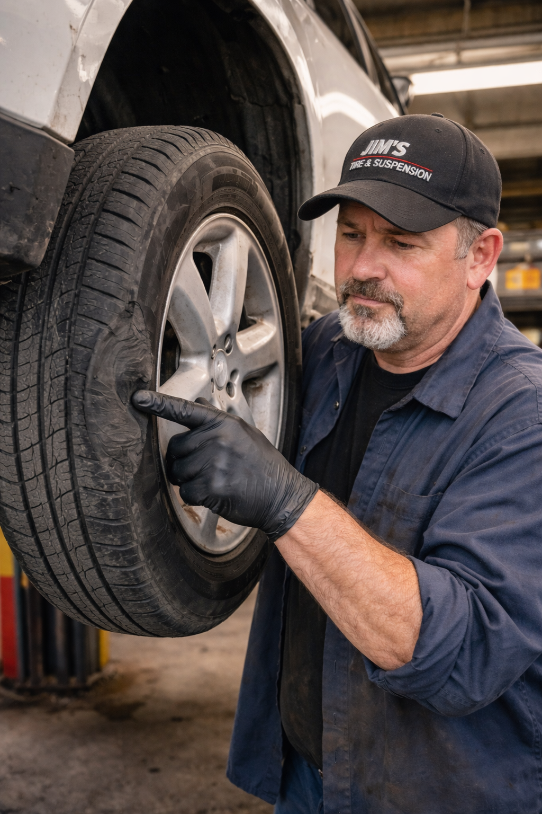

# Stakeholders and Users

## Product Owner/Client
- Dynamic Engineering Squad

## Advisor
- Chris Brooks
- Dr. Becka Morgan

## Developers
- Julian Aguilar-Tomas
- Phillip Alter
- Erin Anderson
- Sunair Iqbal

## Users

### Kyle Glass
- **Age**: 22
- **Occupation**: Delivery Driver
- **Location**: Salem, Oregon
- **Tech Proficiency**: High (Lives on phone, uses navigation/gig apps 8+ hours a day)
- **Background Information**: Kyle is a gig economy worker who spends 40-50 hours a week driving his 2012 Honda Civic around the city delivering food. He knows every shortcut, but more importantly, he knows exactly where every suspension-destroying pothole is located. Last month, he hit a deep pothole on Lancaster Drive that bent his rim and cost him $300 to fix—money he couldn't afford to lose. He feels like the city ignores the roads he drives on daily.
- **Role**: Power User (Would use app constantly)
- **Profile Picture**:
     - 

### Jimothy Slimm
- **Age**: 45
- **Occupation**: Auto Repair Shop Owner
- **Location**: Independence, Oregon
- **Tech Proficiency**: Medium (Uses his phone primarily for work—communicating with customers and sourcing vehicle parts.)
- **Background Information**: Jimothy owns a tire and suspension repair shop on a busy arterial road in Independence. He regularly sees customers come in with damage caused by the same uneven pavement, deteriorating road surfaces, and failing infrastructure near his shop. While these repairs bring him business, he knows they place a financial burden on residents and erode trust in the city’s ability to maintain its roads. Jim uses the app to submit reports tied to vehicle damage risk and actively upvotes high-cost hazards. He values the app’s ability to calculate estimated repair costs and frame infrastructure neglect in financial terms that city officials are more likely to take seriously.
- **Role**: Regular User (Uses the app when issues directly impact his business or customers)
- **Profile Picture**:
     - 

### Maria Gonzales
- **Age**: 42 
- **Occupation**: Elementary School Teacher
- **Location**: Salem, Oregon
- **Tech Proficiency**: Moderate — comfortable using smartphones and common apps, but not highly technical
- **Background Information**: María has lived in Salem for over 15 years and commutes daily to work. She often notices damaged sidewalks, crosswalks, and potholes near her school that make it unsafe for children and parents. She has tried reporting issues in the past through city websites but found the process confusing and time-consuming. María values community involvement and wants an easy way to report issues and track whether they are being addressed, especially those affecting public safety.
- **Role**: Reports and verifies infrastructure issues affecting neighborhood safety.
- **Profile Picture**:
     - 

### Denise Green
- **Age**: 39
- **Occupation**: City of Salem Infrastructure Employee
- **Location**: Salem, OR
- **Tech Proficiency**: Moderate–High (Uses databases, GIS dashboards, ticketing systems, and reporting tools daily)
**Background Information**: Denise works for the city’s Public Works Department, where she helps manage road maintenance requests, service tickets, and infrastructure planning. Every week, she reviews dozens of citizen complaints about potholes, damaged signage, and unsafe road conditions. Currently, much of this information comes in through disconnected channels—phone calls, emails, and paper reports—making it difficult to prioritize urgent issues or identify recurring problem areas. Denise wants a centralized, data-driven system that allows her to view user-submitted reports in real time, verify conditions, update road status, and track whether maintenance crews have resolved the problem. For her, this app is a tool to improve transparency, efficiency, and public trust.
- **Role**: Administrative / Operational User (Uses app daily to manage and update city infrastructure data)
- **Profile Picture**:
     - 
